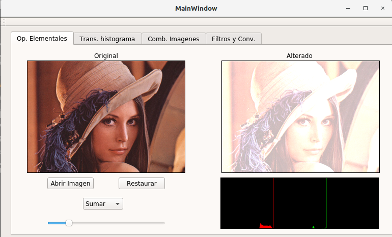
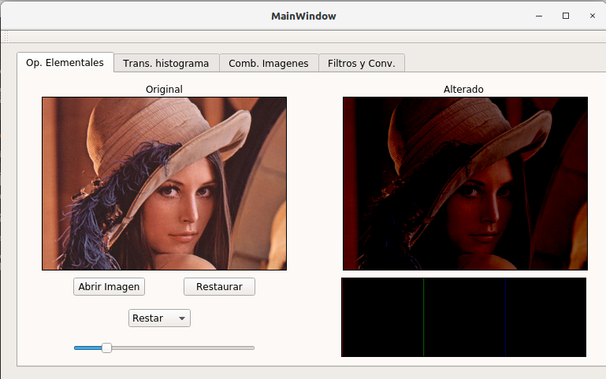
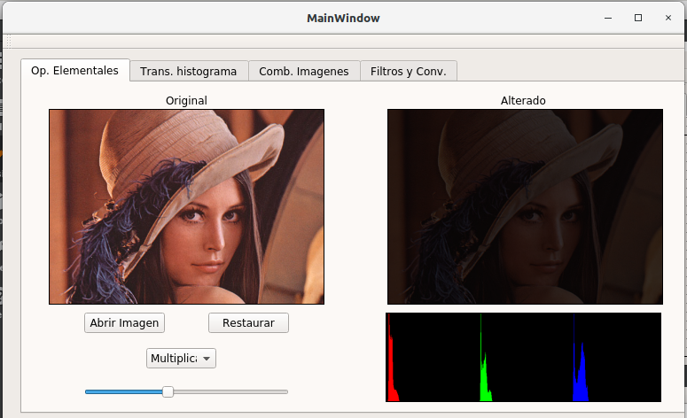
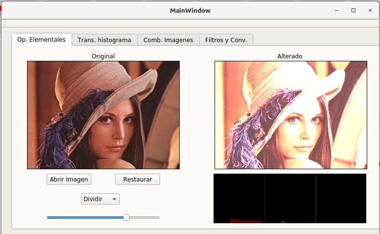
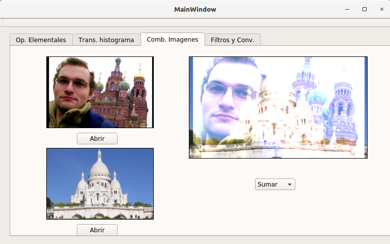
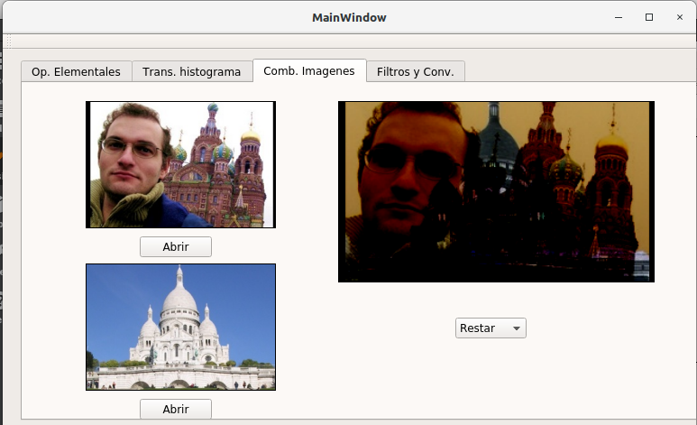
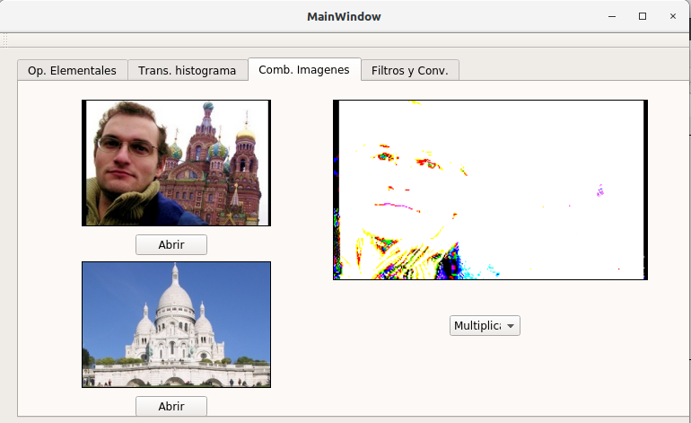
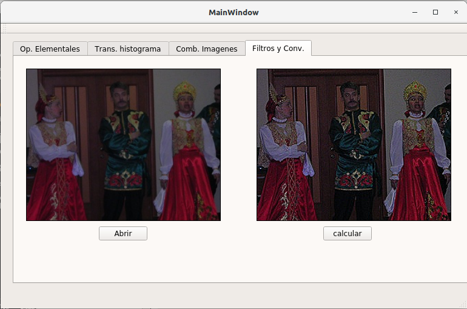

# topicos en computación Gráfica
Tópicos de computación en gráfica - Implementaciones en serie

## **1. Operaciones elementales**
- Suma (ejecutado)
- Resta (ejecutado)
- Multiplicación (ejecutado)
- División (ejecutado)
## Ejecuciones
Todas las ejecuciones están hechas en Qt creator y implementadas en serie.
- Sumar

- Resta

- Multiplicar

- Dividir

## **2. Transformacion del histograma**
- Estiramiento (no ejecutado) 
- Ecualización (no ejecutado)
- Segementación de objetos (no ejecutado)
## **3. Combinación de imágenes**
- Suma (ejecutado)
- Resta (ejecutado)
- Producto (ejecutado)
- División (no ejecutado)
## Ejecuiciones
- Sumar

- Resta

- Multiplicar

## **4. Filtros y transformaciones**
- Convolucion (ejecutado)

## Alumno:
Pancca Mamani, Israel Santiago
